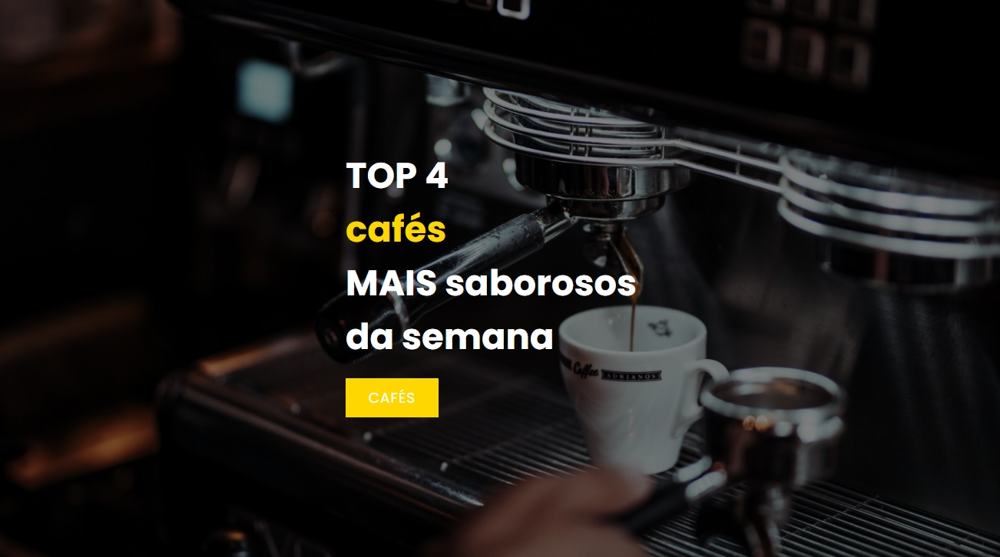
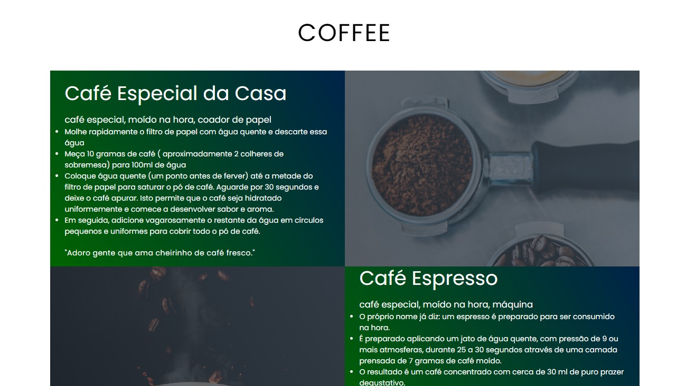
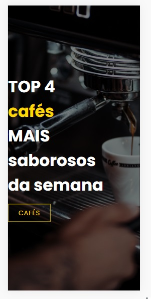
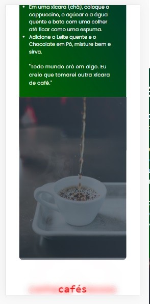

<h3 align="center"> 
	🚧 Coffee🚀
</h3> 

<h1 align="center">
    
</h1>

- projeto desafio da aula ao vivo - 4a semana
- [documentação do css](https://developer.mozilla.org/en-US/docs/Web/CSS) 
- tornar aplicação original: tema de café para a página
- [x] adicionar um contexto ao site: café
- [x] explorar animações em css: roda pé
- [x] adicionar seção: rodapé
- [x] refatorar com tags semânticas
- [x] organizar css: o arquivo está em ordem de elementos html
- [x] usar material css-tricks: título
- [x] usar mais imagens: quatro img
- [x] inserir textos de verdade: receitas
- [x] adicionar roda pé: frase animação css
- [x] centralizar verticalmente header coffee
- [x] centralizar verticalmente footer coffee
- [x] usar material web.dev: internacionalização
- [x] usar material web.dev: unidade de medida fluída

- nossa página

  

